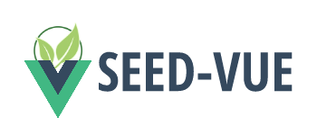

<p align="center">
  
</p>

<p align="center">
  <strong>
    A VUE2 BASED COMPONENT LIBRARY
  </strong>
</p>

<p align="center">
  LIGHTWEIGHT, RESPONSIBLE, AND OPEN-SOURCE
</p>
<p align="center">
  <a href="https://rogeriotaques.github.io/seed-vue">
    📚 Documentation
  </a> •

  <a href="https://github.com/rogeriotaques/seed-vue/issues/new">
    🐞 Report bug
  </a>

  <!--  •
  <a href="https://github.com/rogeriotaques/seed-vue/issues/new?template=feature_request.md">
    📝 Request feature
  </a> -->
</p>

<p ><br /></p>

<p align="center">
  <a href="https://opensource.org/licenses/MIT">
    
  </a>
  <!--
  <a href="https://gitter.im/rogeriotaques/seed-vue">
    
  </a> -->
  <a href="https://github.com/rogeriotaques/seed-vue/issues">
    
  </a>
</p>

<p ><br /></p>

## Quick start

> 💡 This is a very quick start guide. Check the [docs](https://rogeriotaques.github.io/seed-vue/?path=/docs/quick-start--page) for the detailed version.

Install via `Yarn`

```sh
$ yarn add seed-vue
```

or `NPM`

```sh
$ npm install seed-vue
```

Import to start using it.

```js
// e.g main.js or main.ts

import Vue from 'vue';
import SeedVue from 'seed-vue'; // the components
import 'seed-vue/dist/index.css'; // the styles
import App from './YourApp.vue';

Vue.use(SeedVue);

// or import on-demand with
// import { Button } from 'seed-vue';
// Vue.component(Button.name, Button);

new Vue({
  el: '#app',
  render: (h) => h(App)
});
```


Use it on your templates.

```html
<!-- e.g. YourApp.vue -->

<template>
  <div>
    <h1>Hello World</h1>
    <p>
      <s-button color="primary" @click="clickHandler">
        Click to say hello!
      </s-button>
    </p>
  </div>
</template>

<script>
  export default {
    name: 'YourApp',

    methods: {
      clickHandler(event) {
        console.log('CLICKED!', event);
      }
    }
  };
</script>
```

## Contributing

All and every contribution is more than welcome! 🤩 Please contribute. 🙏

### Found a bug? Please, raise an issue.

When raising issues, please:

- Make sure that the same issue was not raised yet
- Add screenshots and/ or animated GIFs to illustrate and make it easier to understand
- Keep in mind that this project is maintained on my spare time, so please don't expect an immediate response or fix to the created ticket. If you just have a question, please [drop me a line on Twitter](https://twitter.com/rogeriotaques)

### Submitting Pull Requests

When contributing with `PR`'s, please keep in mind that SEED-VUE follows the [Semantic Versioning System](https://semver.org/) (a.k.a Semver). Also:

- Make your PR is against the `develop` branch.<br />(The `master` branch is a snapshot from the latest release!)
- Add screenshots and/ or animated GIFs to illustrate and make it easier to understand
- Keep it simple and small. Massive PRs are hard to review and will get less priority
- Make sure you won't commit `dist`, `node_modules`, `docs`, or any other directory or file ignored in the [`.gitignore`](https://github.com/rogeriotaques/seed-vue/blob/master/.gitignore).
- Don't forget to update the `Contributors` session from `readme.md` and include yourself in the list of contributors! 😉

### Contributors

- [@rogeriotaques](https://github.com/rogeriotaques) (author and maintainer)


## License

SEED-VUE - MIT License

Copyright © 2020 Rogerio Taques.

Permission is hereby granted, free of charge, to any person obtaining a copy of this software and associated documentation files (the "Software"), to deal in the Software without restriction including without limitation the rights to use, copy, modify, merge, publish, distribute, sublicense, and/or sell copies of the Software and to permit persons to whom the Software is furnished to do so, subject to the following conditions:

The above copyright notice and this permission notice shall be included in all copies or substantial portions of the Software.

THE SOFTWARE IS PROVIDED "AS IS", WITHOUT WARRANTY OF ANY KIND, EXPRESS OR IMPLIED, INCLUDING BUT NOT LIMITED TO THE WARRANTIES OF MERCHANTABILITY, FITNESS FOR A PARTICULAR PURPOSE AND NONINFRINGEMENT. IN NO EVENT SHALL THE AUTHORS OR COPYRIGHT HOLDERS BE LIABLE FOR ANY CLAIM, DAMAGES OR OTHER LIABILITY, WHETHER IN AN ACTION OF CONTRACT, TORT OR OTHERWISE, ARISING FROM, OUT OF OR IN CONNECTION WITH THE SOFTWARE OR THE USE OR OTHER DEALINGS IN THE SOFTWARE.
